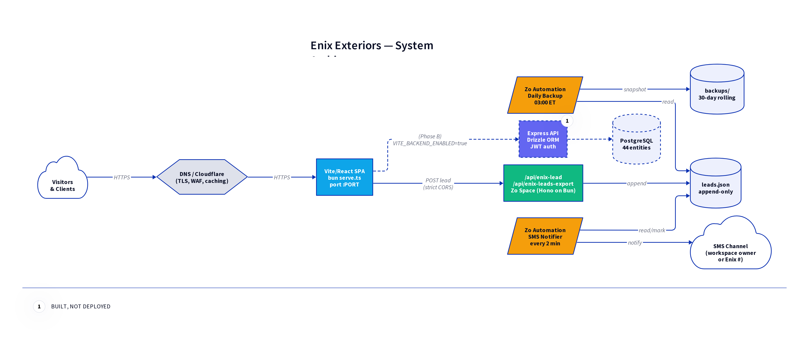

# Enix Exteriors — Architecture

## Layers

### 1. Edge / DNS / TLS

- **Recommended:** Cloudflare in front of the origin (free tier covers TLS, WAF, caching, DDoS mitigation, Brotli).
- Origin can be any modern Linux VPS. The deployment runbook assumes Ubuntu 22.04 LTS with Nginx as the reverse proxy.
- TLS via Let's Encrypt + certbot or Cloudflare Origin certificates.

### 2. Frontend (live)

- **Stack:** Vite 6, React 18, react-router-dom v6, TanStack Query v5, Tailwind, shadcn/ui (Radix primitives), framer-motion, DOMPurify.
- **Build:** `npm run build` → static `dist/` folder.
- **Runtime:** A 100-line Bun static server (`file serve.ts`) handles MIME types, security headers, SPA fallback for client-side routing, 404s for missing assets, immutable caching on hashed assets, `/healthz` endpoint.
- **Routing:** All public pages, the Education Hub (50 articles, sourced from `file src/lib/articles.js`), client/staff login pages, plus a `<BackendGated>` wrapper that swaps CRM/Portal/SmartDocs routes for a `<BackendOffline>` notice until `VITE_BACKEND_ENABLED=true`.
- **API client:** `file src/api/client.js` matches the original Base44 SDK shape (`entities`, `auth`, `functions`, `integrations`) so component code didn't have to change. `file src/api/base44Client.js` is a 10-line re-export shim.

### 3. Lead-intake API (live)

- **Stack:** Hono on Bun, running on Zo Space platform.
- **Routes:**
  - `POST /api/enix-lead` — public, with strict CORS allowlist, per-IP rate limiting (5/10min), honeypot, bot UA detection, TCPA gate, email/phone shape validation.
  - `GET /api/enix-leads-export` — bearer-auth, JSON or CSV.
- **Storage:** Append-only `file leads.json` in the workspace filesystem.
- **Code:** Portable to Express in &lt;30 minutes. Source in `leads-api/`.

### 4. Automations (live)

- **SMS Notifier** — every 2 min, reads unnotified leads, sends SMS, marks `notified=true`.
- **Daily Backup** — 03:00 ET, snapshots `file leads.json` to `backups/`, prunes &gt;30d old.

### 5. Backend (built, not deployed)

- **Stack:** Express 5, PostgreSQL ≥ 14, Drizzle ORM, JWT (jsonwebtoken), Argon2id (argon2 pkg), Helmet, Pino structured logs with redaction.
- **Schema:** All 44 entities from the original Base44 model. Foreign keys, indexes on common query columns, UUIDs as PKs.
- **Auth:** Access + refresh JWTs. Refresh tokens hashed and stored server-side (`refresh_tokens` table), enabling revocation. Cookies are httpOnly, Secure, SameSite=Strict in production.
- **Routes:** Auth, leads, jobs, customers, estimates, invoices, smartdocs. Generic `file _crud.ts` factory for the long tail of entities.
- **Validation:** Zod schemas in `file validators/schemas.ts`. Central error handler maps `ZodError`, `HttpError`, and unknown errors to consistent JSON responses.
- **Observability:** Pino + pino-http with sensitive-field redaction. Health endpoint at `/api/health`.

## Data flow — capture a lead

1. User submits the form on the frontend.
2. Frontend POSTs to `VITE_LEAD_API_URL` (the Zo Space route).
3. Route validates origin (CORS), rate limit, honeypot, bot UA, payload shape.
4. Lead is appended to `file leads.json` with `notified: false`.
5. Within 2 minutes, the SMS Notifier automation reads unnotified leads, sends SMS, marks them notified, writes back.
6. Nightly, the Daily Backup automation snapshots the file.

## Data flow — Phase B (CRM live)

1. Same lead-intake path as above.
2. **Additionally** the route writes through to the Express API's `POST /api/leads` (or replace the Zo route entirely with the Express endpoint).
3. CRM dashboard reads from Postgres via the typed API client.
4. Auth flow: `/api/auth/login` → access cookie (15m) + refresh cookie (30d, httpOnly). Frontend auto-refreshes on 401.

## File locations

| Concern | Path |
| --- | --- |
| Frontend source | `frontend/src/` |
| Frontend pages | `frontend/src/pages/` |
| Reusable components | `frontend/src/components/` |
| Article data |  |
| API client |  |
| Frontend server |  |
| Backend source | `backend/src/` |
| DB schema |  |
| Route handlers | `backend/src/routes/` |
| Auth | `backend/src/auth/` |
| Validators |  |
| Lead intake routes |  |
