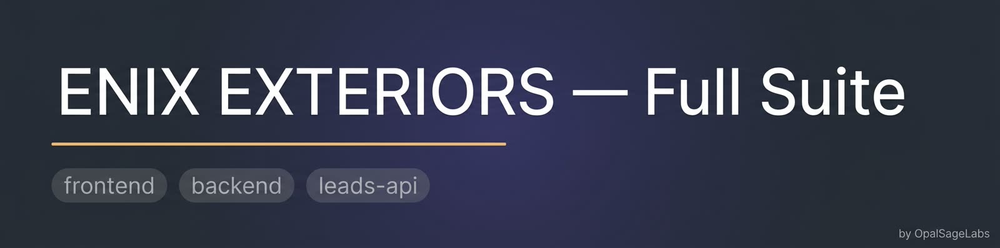

<div align="center">



<br />
<br />

# Enix Exteriors — Full Suite

**Production-grade roofing CRM, client portal, and lead-intake suite.** A modern, fully owned alternative to ServiceTitan, JobNimbus, and Base44 engineered, hardened, and operated by [OpalSageLabs](https://github.com/OpalClaw).

<br />

[](https://github.com/OpalClaw/Enix-Full-Suite-website/actions/workflows/ci.yml)
[](https://github.com/OpalClaw/Enix-Full-Suite-website/actions/workflows/codeql.yml)
[](./LICENSE)
[](https://github.com/OpalClaw/Enix-Full-Suite-website/releases)
[](https://nodejs.org)
[](https://bun.sh)
[](https://postgresql.org)
[](./SECURITY.md)
[](https://www.conventionalcommits.org)

</div>

---

## Overview

**Enix Exteriors — Full Suite** is the production codebase that powers an entire roofing and exterior services business: a public marketing site, a 50-article SEO Education Hub, a hardened lead-intake pipeline, an internal CRM dashboard, a self-service client portal, and a SmartDocs estimate-to-signature engine. It is a fully owned alternative to vendor-locked platforms like ServiceTitan, JobNimbus, and Base44 built so a single roofing operator (or a multi-tenant fleet of them) can run their entire revenue motion on infrastructure they actually own.

The repository is organized as a three-component monorepo and is **deployable today as a single-tenant install**, with a documented, additive migration path to multi-tenant SaaS already laid into the schema and middleware. Every component is independently buildable, testable, and shippable, with hardened defaults, structured logs, correlation IDs across requests, and a security posture aligned with OWASP ASVS Level 2 and the OpalSageLabs enterprise engineering standard.

This is **v0.1.0** — the first production-tagged release of the suite. It is the foundation, not the finish line. The roadmap below tracks what comes next.

---

## Components

| Component | Stack | Purpose | Status |
|---|---|---|---|
| [`frontend/`](./frontend) | Vite 6 · React 18 · Tailwind 3 · React Router 6 · TanStack Query | Marketing site, 50-article Education Hub, CRM dashboard, client portal, SmartDocs editor | ✅ Ships clean build, 0 lint errors |
| [`backend/`](./backend) | Node 20 · Express 5 · TypeScript strict · Drizzle ORM · PostgreSQL 15 · Argon2id · JWT · Pino | REST API for auth, customers, leads, jobs, estimates, invoices, payments, and SmartDocs | ✅ `tsc --noEmit` clean, 11 unit tests pass |
| [`leads-api/`](./leads-api) | Bun 1.1 · Hono 4 · Zod | Public lead-intake + admin export endpoints, deployable to Zo Space or any Bun host | ✅ 22 unit tests pass |

---

## Architecture

```
┌──────────────────────┐    HTTPS    ┌──────────────────────────┐
│  Public visitor      │────────────▶│  frontend/  (Vite SPA)   │
│  (marketing + lead)  │             │  Cloudflare Pages / CDN  │
└──────────────────────┘             └────────┬─────────┬───────┘
                                              │         │
                          POST /api/enix-lead │         │ /api/* (cookies)
                              (CORS-locked)   │         │ (httpOnly JWT)
                                              ▼         ▼
                                ┌──────────────────┐  ┌──────────────────┐
                                │  leads-api/      │  │  backend/         │
                                │  Bun + Hono      │  │  Express 5 + TS   │
                                │  Honeypot + UA   │  │  Helmet + CORS    │
                                │  Rate limit + Zod│  │  Argon2id + JWT   │
                                │  CSV-safe export │  │  Refresh rotation │
                                └────────┬─────────┘  └────────┬──────────┘
                                         │                     │
                                         ▼                     ▼
                                ┌────────────────┐    ┌──────────────────┐
                                │  leads.json    │    │  PostgreSQL 15   │
                                │  (durable disk)│    │  Drizzle ORM     │
                                └────────────────┘    │  Multi-tenant ready│
                                                      └──────────────────┘
```

Full architecture diagrams, threat model, multi-tenancy contract, and per-endpoint API reference live under [`docs/`](./docs).

---

## Quickstart

Prerequisites: Node ≥ 20, Bun ≥ 1.1, PostgreSQL ≥ 15.

```bash
git clone https://github.com/OpalClaw/Enix-Full-Suite-website.git
cd Enix-Full-Suite-website
make install          # installs all three components
make db-up            # creates a local Postgres database
make migrate          # runs migrations (0000 init + 0001 security hardening)
make dev              # boots frontend + backend + leads-api together
```

Then visit:

- Frontend dev server — http://localhost:5173
- Backend health — http://localhost:3001/health
- Leads-API health — http://localhost:3002/health

For full setup including production deployment, see [`docs/DEPLOYMENT.md`](./docs/DEPLOYMENT.md).

---

## Security posture

Aligned with OWASP ASVS Level 2 and audited under the OpalSageLabs enterprise standard. Highlights:

- **Authentication.** Argon2id password hashing (OWASP 2024 parameters), JWT HS256 with explicit algorithm allowlist (alg=none and alg-confusion blocked by tests), refresh-token rotation with **session-family revocation on token reuse**, account lockout after 5 failed attempts in 15 minutes, constant-time login responses to prevent user enumeration.
- **Transport.** HSTS with preload, COOP, CORP, X-Frame-Options DENY, Referrer-Policy, Permissions-Policy locking down camera/mic/geo/payment/USB, X-Content-Type-Options nosniff. CORS is allowlist-only with no wildcards.
- **Input.** Zod strict schemas reject unknown fields (prototype-pollution defense). Request bodies capped at 1 MB. Lead intake additionally caps at 64 KB before JSON parse.
- **CSV export.** OWASP formula-injection escape on every cell (`=`, `+`, `-`, `@`, tab, CR prefixed with `'`), RFC-4180 quoting, atomic write via temp-file + rename, serialized through an in-process write mutex.
- **Operations.** Correlation ID on every request, propagated to logs and error responses. Pino structured logs. Graceful shutdown with 10s hard-stop. Helmet defaults extended with explicit permissions policy.
- **Supply chain.** Dependabot weekly on all three ecosystems. CodeQL `security-extended` on every PR. gitleaks pre-commit. License allowlist in CI. PRs are gated by branch protection requiring all checks + CODEOWNERS review.

Private disclosure: **OpalClaw@opalsagelabs.click** — see [`SECURITY.md`](./SECURITY.md).

---

## Repository layout

```
.
├── .github/              CI, CodeQL, release, dependabot, CODEOWNERS, templates
├── backend/              Express API (TypeScript strict)
├── docs/                 Threat model, multi-tenancy contract, API reference
├── frontend/             Vite + React SPA
├── leads-api/            Bun + Hono public intake
├── scripts/              Operational scripts
├── CHANGELOG.md          Keep a Changelog format, SemVer
├── CODE_OF_CONDUCT.md    Contributor Covenant 2.1
├── CONTRIBUTING.md       Development setup, conventions, PR process
├── LICENSE               Commercial — proprietary to Enix Exteriors LLC
├── Makefile              install · build · test · lint · migrate · security
├── README.md             You are here
└── SECURITY.md           Private disclosure pipeline + supported versions
```

---

## Roadmap

The 0.1.0 milestone shipped the foundation. The 0.2.x line is focused on hardening the multi-tenant path and observability:

- [ ] **0.2.0** — Promote `tenant_id` to `NOT NULL` across all scoped tables; enable Postgres RLS; tenant-scoped JWT claim middleware
- [ ] **0.2.1** — Per-tenant rate limits + per-tenant audit log retention policy
- [ ] **0.3.0** — OpenTelemetry tracing + Prometheus metrics endpoint; Grafana dashboard pack
- [ ] **0.3.1** — Stripe Connect for tenant-owned merchant accounts
- [ ] **0.4.0** — SOC 2 Type I evidence pack (control mapping in `docs/COMPLIANCE.md`)
- [ ] **1.0.0** — General availability; signed releases via cosign; SBOM published on every tag

See [issues](https://github.com/OpalClaw/Enix-Full-Suite-website/issues) for live status.

---

## License

This software is delivered under a **commercial license** to Enix Exteriors LLC for their internal business use. See [`LICENSE`](./LICENSE) for the full terms.

© 2026 OpalSage Labs / OpalClaw. All rights reserved.

For commercial licensing, enterprise support, white-label deployments, or custom builds: **OpalClaw@opalsagelabs.click**.

---

<div align="center">

**Built and operated by [OpalSageLabs](https://github.com/OpalClaw).**
For commercial licensing, enterprise support, or custom builds — **OpalClaw@opalsagelabs.click**.

</div>
